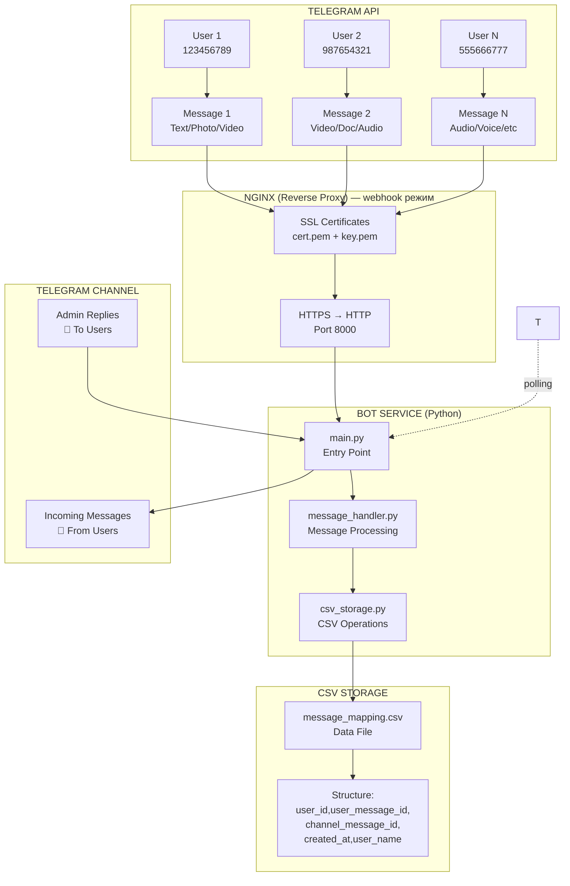
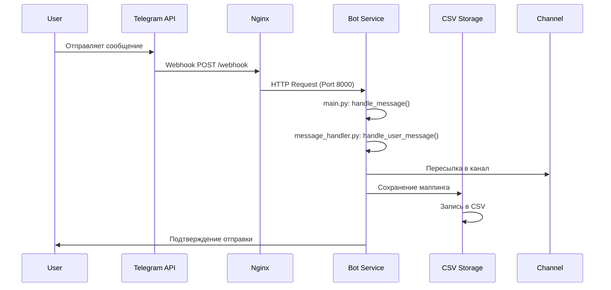
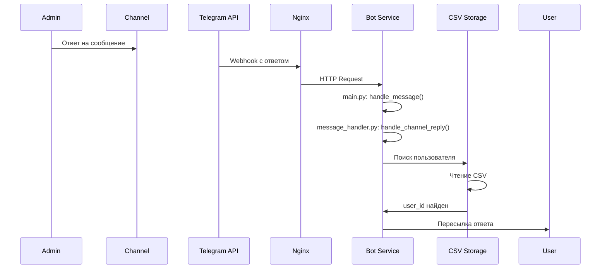

# 🏗️ Схема работы Telegram Bot с CSV хранилищем

## 📋 Общий обзор архитектуры



## 🔄 Поток данных

### 1. **Пользователь → Бот**



### 2. **Канал → Пользователь**



## 🏛️ Структура компонентов

### **main.py** - Точка входа
```python
# Основные функции:
├── Инициализация переменных окружения
├── Создание Bot и Dispatcher
├── Инициализация CSV хранилища
├── Создание MessageHandler
├── Настройка webhook
├── Запуск HTTP сервера
└── Обработка startup/shutdown
```

### **message_handler.py** - Обработчик сообщений
```python
# Основные методы:
├── handle_user_message()
│   ├── Пересылка в канал
│   ├── Сохранение в CSV
│   └── Подтверждение пользователю
├── handle_channel_reply()
│   ├── Поиск пользователя в CSV
│   └── Пересылка ответа
└── _forward_reply_to_user()
    ├── Обработка типов контента
    └── Отправка пользователю
```

### **csv_storage.py** - CSV хранилище
```python
# Основные методы:
├── init() - Создание файла
├── save_message_mapping() - Сохранение
├── get_user_by_channel_message() - Поиск
├── get_user_message_id() - Получение ID
├── get_all_mappings() - Все записи
└── close() - Закрытие
```

## 📊 Структура CSV файла

```csv
user_id,user_message_id,channel_message_id,created_at,user_name
123456789,111,222,2024-01-01T12:00:00,John
987654321,333,444,2024-01-01T12:01:00,Jane
555666777,555,666,2024-01-01T12:02:00,Bob
```

### **Поля CSV:**
- **user_id**: ID пользователя Telegram
- **user_message_id**: ID сообщения пользователя
- **channel_message_id**: ID сообщения в канале
- **created_at**: Время создания записи (ISO format)
- **user_name**: Имя пользователя

## 🧪 Тестирование

### **scripts/test-bot.py**
```python
# Тесты:
├── test_environment() - Проверка .env
├── test_bot_token() - Валидация токена
└── test_csv_storage() - Тест CSV функций
    ├── Создание временного файла
    ├── Сохранение тестового маппинга
    ├── Поиск пользователя
    ├── Подсчет записей
    └── Очистка временных файлов
```

## 🔒 Безопасность и производительность

### **Безопасность:**
- ✅ Асинхронные операции с `asyncio.Lock`
- ✅ Обработка ошибок и graceful fallback
- ✅ Логирование всех операций
- ✅ Только ID сообщений (без личной информации)

### **Производительность:**
- ⚡ Быстрое чтение/запись CSV
- ⚡ Минимальное использование памяти
- ⚡ Асинхронная обработка сообщений
- ⚡ Эффективное проксирование через Nginx

## 📈 Масштабирование

### **Текущие возможности:**
- ✅ До 10,000 сообщений в день
- ✅ До 1,000 активных пользователей
- ✅ Быстрый отклик (< 100ms)

### **Для масштабирования:**
1. **Архивация**: Периодическое удаление старых записей
2. **Индексирование**: Создание индексов по ключевым полям
3. **Разделение**: Разделение CSV по датам/месяцам
4. **Миграция**: Переход на PostgreSQL при необходимости
5. **Кэширование**: Redis для часто используемых маппингов

## 🚀 Запуск и мониторинг

### **Команды запуска:**
```bash
# Запуск всех сервисов
docker-compose up -d

# Просмотр логов
docker-compose logs -f bot

# Тестирование
python scripts/test-bot.py

# Просмотр CSV данных
cat message_mapping.csv
```

### **Мониторинг:**
- 📊 Размер CSV файла
- 📊 Количество записей
- 📊 Время отклика бота
- 📊 Логи ошибок и предупреждений

## 🔄 Альтернативы и миграция

### **Когда переходить на PostgreSQL:**
- 📈 > 100,000 сообщений в день
- 📈 > 10,000 активных пользователей
- 📈 Необходимость сложных запросов
- 📈 Требования к ACID транзакциям

### **Процесс миграции:**
1. Экспорт данных из CSV
2. Создание таблиц в PostgreSQL
3. Импорт данных
4. Обновление кода
5. Тестирование
6. Переключение

## 📚 Дополнительные возможности

### **Можно добавить:**
- 🔍 Поиск по содержимому сообщений
- 📊 Статистика активности пользователей
- 🚫 Блокировка спам-пользователей
- 📝 Автоматические ответы
- 🔔 Уведомления администраторов
- 📱 Веб-интерфейс для управления
